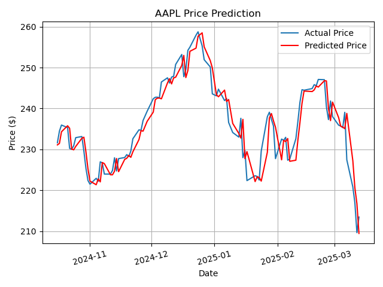
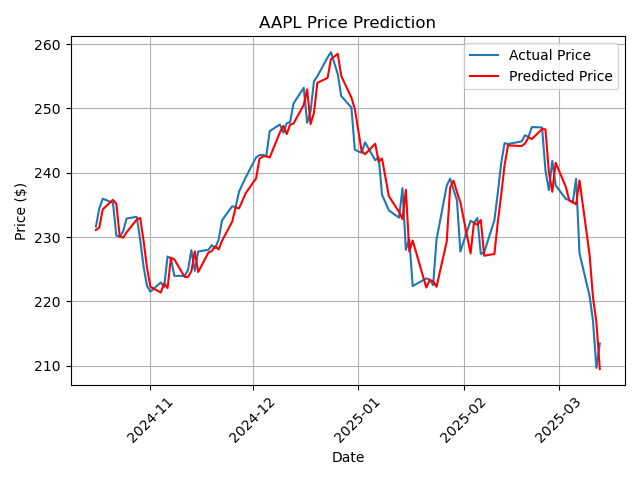

# Stock Price Prediction
- **Goal**: Predict AAPL stock prices using historical data.
- **Steps**: Fetched data with yfinance, created features (MA_10, MA_50), built a linear regression model.
- **Results**: MSE of 12.48, visualized trends and predictions.
- **Tools**: Python, Pandas, Matplotlib, Scikit-learn, yfinance.
- 
- 
